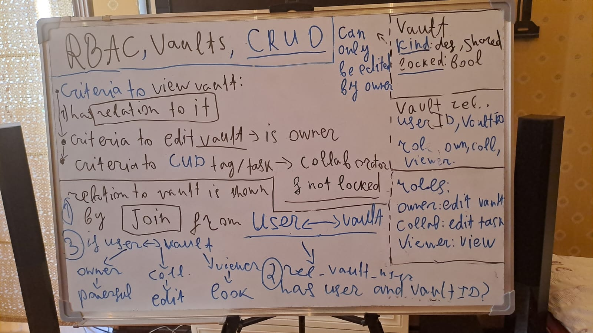

chat gippity made the readme
im doing this to learn htmx and golang i hate react now im a htmx-grug-pilled dev, f the virtual dom
chat gippity made most of my frontends styles btw

---

## TODOS:

- [x] finish the main page and abstract the update logic of the tags
- [x] split the task updating and tag creation/relation endpoints
- [x] make ui composable
- [x] implement the get task by tags page
- [x] implement manage tags page
  - [x] implement CRUD on tags, make it a card based ui for CRUDing tags
- [x] make the dropdowns for adding relations only show items which havent been added already as tags
- [x] add many to many relationship thing and show tasks related to tag in the card
- [x] implement tags page tag relation to task
- [x] make the footer work
- [x] IMPLEMENT ACTUAL FILTERING ON TASKS PAGE

  - [x] implement searching by name
  - [x] implement filtering by tag
  - [ ] implement filtering by completed (cba)

- [x] read the other md files rq
- [x] refactor v1.5

  - [x] add net/http and remove echo
  - [x] add decent logging on errors
  - [x] move handler logic outside of the router
  - [x] add sqlc
  - [x] complete the rest of the app, get it back to how it was

- [x] implement actual database migrations
- [x] add the actual http/1.1 response and request in the logging middleware so i know http strings are being sent and recieved over http
- [x] host with https on local network

- [x] add barebones auth using cookies
- [ ] then jwt

  - [x] finish the migration business
  - [x] implement the readme on how to add session auth
  - [x] add sql to the sessions instead of storing them in memory
  - [x] make an indicator showing if the user is logged in or not
  - [x] finish fetching the tags and shit
  - [x] change the hx-redirects to just forms with actions
  - [ ] block csrf, add session expirations, add jwt

- [x] refactor v2 (vaults)

  - **notes**
  - note to self: every tag action based on its vault should be validated with the user id

  - **large scale objectives**
  - 

  - **objectives**
  - [x] replace auto incrementing ids with uuids (no random id guess attack vector)
  - [x] make it work with the uuids and vault ids now

    - [x] change all of the queries to use vault ids
    - [x] add default vault id to users, add vault type
    - [x] make the sign up create a default vault

  - [x] add author info to tags and tasks, fix the n+1s with joins, fix updatednow

    - [x] tags
    - [x] tasks
    - [x] fix the n+1 problem with author info

  - [x] fix the workflow

    - [x] make all queries work with roles and vaults
    - [x] change constraints of uniqueness to include vaults

  - [x] add redirect to tasks/vault filter on tag id click
  - [x] [golang standards project layout](https://github.com/golang-standards/project-layout) conform to this structure 
  - [x] ALWAYS Update the updated_now fields so its actually true
  - [x] order everything by created_at
  - [x] add ROLE CHECKING to the tag CUD operations as per 
  - [x] !!! add a vault middleware which gives the vault depending on if the route is the shared one or the default one, cuz rn its only default

  - [x] add vaults page

    - [x] fix bug where you cant see the people connected to the vaults
    - [x] fix bug where i can see other peoples tasks at /tasks
    - [x] fix bug where i can edit other peoples vaults without being owner
    - [x] add removing collaborators if ur owner
    - [x] stop 1 user from having multiple entries of a role (I already implemented that security measure, I guess im not that dumb after all.)
    - [x] fix that one stupid bug where an owner can remove themselves as a collaborator

- [ ] Best practices refactor

  - **I'm gonna do this boring shit later, going a bit forward so i can do websockets**
  - [ ] fix users being able to see other peoples individual tags without auth
  - [ ] test for security issues
  - [ ] Error handling, SQL, better authz

    - [ ] ADD ACTUAL RBAC AND RLS INSTEAD OF THIS BS EXISTS SHIT!
    - [ ] take a look at whole codebase sql and search for security issues before proceeding
    - [ ] add some serverside error handling that gives back descriptive errors instead of sql (its secured rn but make it responsive to the user)
    - [ ] add alphabetical sorting to everything after created_at so its uniform!

  - [ ] add decent error logging
  - [ ] add sql query logging
  - [ ] fix that one dumb down migration at 8
  - [ ] fix add tag in tasks page
  - **move onto phase with collaborative vaults with websockets**

- [ ] Make the multi user part work (vault implementation)

  - [x] finish vault introduction page
  - [x] add "upload profile picture" to sign up
  - [x] learn about websocket pub/sub architecture
  - [x] make the debug page show which clients are connected (names)
  - [x] make the pub/sub channel(vault) based
  - [x] authorize the websocket connections
  - [ ] create my own http verb system in websockets

    - [ ] make task stuff work
    - [ ] make the tag stuff work

  - [ ] make real time mouse sharing
  - [ ] add error logging to RBAC issues
  - [ ] create the "endpoints" in websockets

### maybe later if i revisit

- [ ] add a home page with "current active users"
- [ ] add JSON endpoint for mobile app, openapi specs

  - [ ] add some documentation to the json returning api

- [ ] add notification system via sse

  - [ ] users can request others access to vaults
  - [ ] x user edited this, etc

- [ ] add some tests bruh

---

Aight 😤 let’s cook something that's:

- 🔥 fun to build
- 🧠 hits core web fundamentals (routing, templates, components, state)
- 💡 has room to grow into full-stack if you want later
- 🛠️ perfect for your **Go + HTMX + Tailwind** stack

---

## 🎯 Project Idea: **Task Vault**

> A keyboard-driven task manager with nested tasks, tagging, filters, and HTMX-powered inline editing.

### 🧩 Features (V1)

- 📝 Add / Edit / Delete tasksw
- 🏷️ Tag tasks with colors (e.g., `#school`, `#project`, `#bug`)
- ✅ Mark tasks complete
- 🧵 Nest sub-tasks inside parent tasks
- 🔍 HTMX-powered search and tag filter
- 💥 All inline — no page reloads

---

### 📐 Pages

| URL          | Purpose                |
| ------------ | ---------------------- |
| `/`          | Dashboard w/ all tasks |
| `/tasks/:id` | Focus view on one task |
| `/tags/:tag` | Filtered view by tag   |
| `/about`     | (optional) About page  |

---

### 🧠 What You’ll Practice

- Go HTML templates w/ layout + components ✅
- HTMX for real-time interactivity ✅
- Tailwind for styling ✅
- URL routing + query handling in Go ✅
- Basic CRUD over a slice/map (or SQLite later) ✅
- Optional: persistence w/ a local file or sqlite 🔥
- Optional: keyboard shortcuts (`js + htmx`) 🔥

---

### 🔄 Future You Could Add

- ⏱️ Due dates + calendar view
- 🔁 Recurring tasks
- 📦 Export to Markdown / JSON
- 🔒 Auth if you make it multi-user later

---
