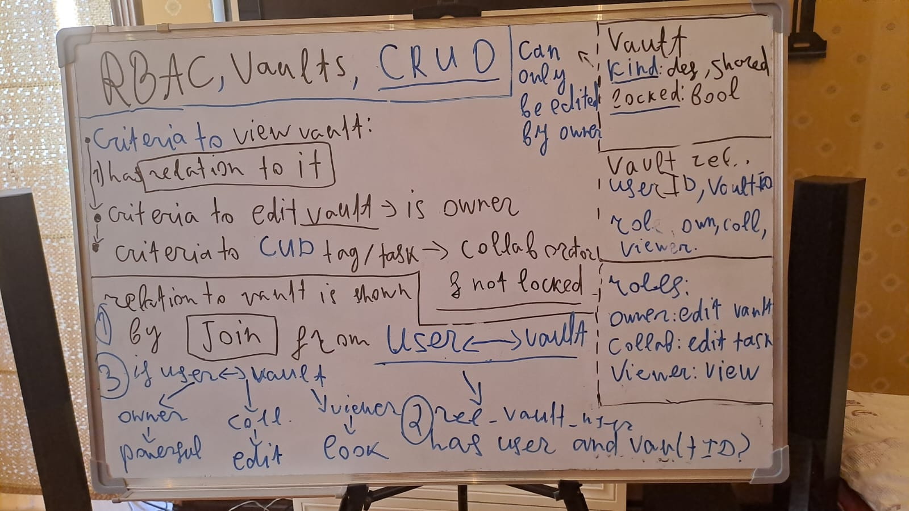

# Swagtask

this project started off as a fork of a lesson given by ThePrimeagen on Frontend Masters which then went to be this project.

Everything here was hand-rolled (even the pub-sub) and follows **_HATEOAS_**.

no frameworks, no build step, just :Go stdlib and htmx
pub-sub, websockets, and all the glue code is mine
no dependencies, no npm, no yarn, no package.json (If I havent made it clear yet, I'm tired of JS build step/dependency hell.)
This app is a heavy WIP.

I made this website to test the limits of a no build-step, low-js, zero dependency system.

I stumbled upon the Go programming language, the Go standard library and HTMX, Which I fell in love with after developing this app. I am quite impressed with how far I was able to take this considering it was my first experience with all of these technologies.

Because of this project being so no-dependency focused I actually managed to learn many topics I delegated to SaaS and libraries previously.

Most notably being http, networking and how the browser actually works -> this was delegated to nextjs previously and I didnt understand the network tab in my browser, with htmx the network tab becomes a first class citizen in development which greatly enhanced my understanding of REST principles and http/s.

You become enlightened to browser native caching techniques and actual performance optimizations instead of pointless v-dom rerender juggling with state and memoization attemps.

HTMX is lean and mean, low-level in terms of browser primitives and imperative; a joy for backend developers who want to write very little frontend code.

Really enjoyed that freedom this project.

Getting exposed to an event-driven system leveled me up and now I really know when I need smth reactive (lets say a chat app thats dynamic in terms of client side rendering) or when i need smth event driven (most things). This realization has piqued my interest in templ and alpine, which I believe could be a good replacement to the missing part of my stack, being islands of reactivity and componentization

My only drawbacks here have been the lack of UI componentization and typesafety (in go's http/template). In my future projects I'll use templ for sure. Template based dev ain't for me, more of a components guy.

And for the realtime thing I think a reactive way of doings things would be better if the system got more complex. (this is just a hunch though, after I do the alpine stuff I'll have an opinion on this for real)

## hand drawn architecture of the CRUD / RBAC-ish thnig

 

 
---

task history + future tasks: [tasks.md](tasks.md)
